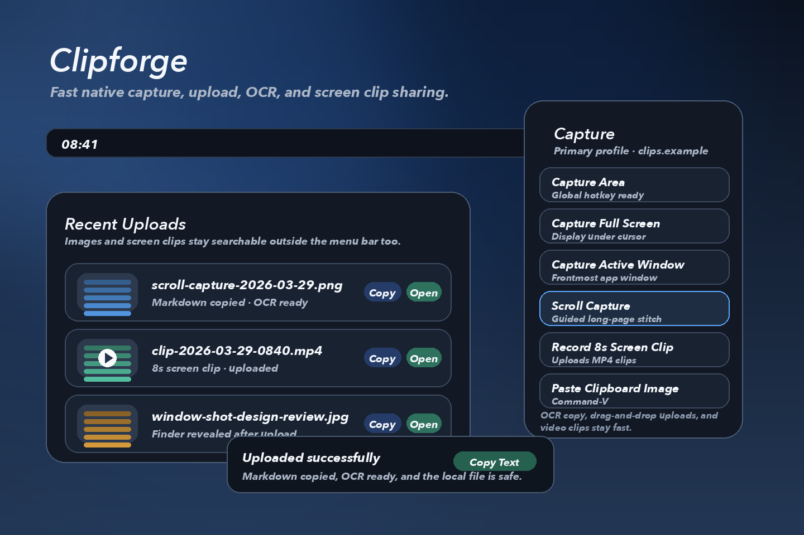
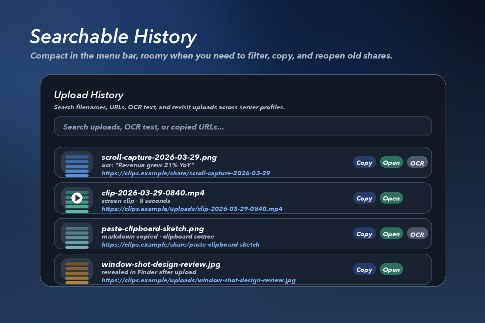
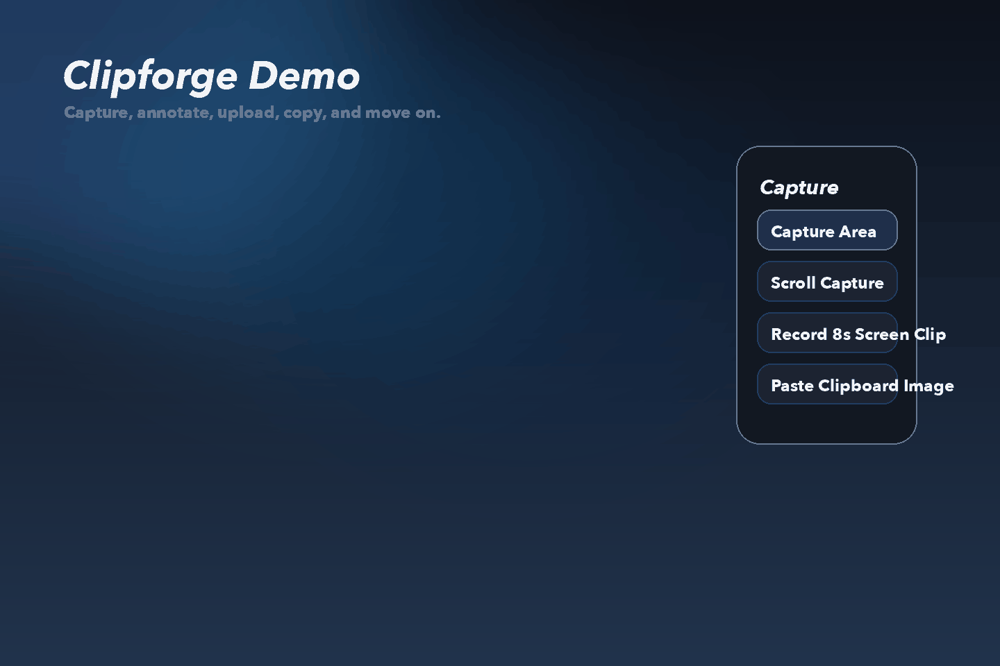

# Clipforge

[](https://github.com/mixutin/clipforge/actions/workflows/ci.yml)
[](./LICENSE)

Clipforge is a native macOS capture uploader built for speed, simplicity, and self-hosting.

Press a global hotkey, capture part of the screen, upload it to your own server, copy the returned share link, and keep moving.

## What Is Included

- `Clipforge`: a native macOS menu bar app built with Swift, SwiftUI, AppKit, Vision, and ScreenCaptureKit
- `Clipforge Server`: a small FastAPI backend for authenticated image and short video uploads plus static file serving

## Highlights

- Native macOS menu bar workflow
- Area capture and full-screen capture
- Active-window capture
- Guided scroll capture for long pages
- Short screen clip recording and upload
- Global hotkey support
- Configurable hotkey recorder UI
- ScreenCaptureKit-based screenshots
- OCR on captured images with quick text copy actions
- Bearer-token authenticated multipart uploads
- Keychain-backed API token storage
- Multiple named server profiles in the macOS app
- Automatic clipboard copy of uploaded URLs, Markdown, or HTML image tags
- Slack mrkdwn and Discord-friendly quick-share copy formats
- Configurable post-upload quick actions
- Clipboard-only capture mode when you do not want to use a server
- Drag-and-drop image uploads from Finder or other apps
- Clipboard image/file paste with `Command-V` and live clipboard detection
- Upload progress UI for larger uploads
- Optional annotation review with arrows, boxes, highlights, and freehand pen markup
- Configurable image format output with PNG, JPEG, and JPEG quality controls
- Richer filename styles with template placeholders for date, time, display name, source name, and random suffix
- Local recent upload history
- Searchable upload history window outside the compact menu bar popover
- Thumbnail previews in recent uploads
- Local-first settings
- Sparkle-powered in-app update checks
- Self-hosted backend with local disk storage
- Backend support for image and short video uploads
- Token-authenticated backend delete endpoint for removing uploads
- Optional Open Graph share pages for cleaner Discord-style embeds
- Optional signed or expiring public links
- Optional server-side image optimization, resizing, and WebP conversion
- Optional S3-compatible object storage for backend uploads
- Optional Developer ID signing and notarization in the release workflow
- Permissive open-source licensing

## Preview







## Repo Layout

```text
.
├── Clipforge/        # macOS app
├── ClipforgeServer/  # FastAPI backend
├── docs/             # project documentation
└── .github/          # CI, issue templates, repo automation
```

## Quick Start

### 1. Run Clipforge Server

```bash
cd ClipforgeServer
python3 -m venv .venv
source .venv/bin/activate
pip install -r requirements.txt
cp .env.example .env
uvicorn app.main:app --reload --host 0.0.0.0 --port 8000 --env-file .env
```

### 2. Run The macOS App

```bash
cd Clipforge
xcodegen generate
open Clipforge.xcodeproj
```

Build and run the `Clipforge` scheme, then configure:

- one or more named server profiles
- server URL, for example `http://127.0.0.1:8000`
- API token matching your server config

## Product Flow

1. Launch Clipforge into the menu bar
2. Trigger `Capture Area` from the popover or with the global hotkey
3. Drag to select a region
4. Clipforge captures the image with ScreenCaptureKit
5. The image uploads to the active self-hosted server profile
6. The server returns a public URL
7. Clipforge copies the URL to the clipboard and shows a success toast

The app also supports OCR-assisted copy actions, scroll capture for longer pages, and short screen clip uploads when a server profile is configured.

## Documentation

- [Agent Guide](./AGENTS.md)
- [Architecture](./docs/architecture.md)
- [Self-Hosting Guide](./docs/self-hosting.md)
- [Install Guide](./docs/install.md)
- [Project TODO](./TODO.md)
- [Release Guide](./docs/releases.md)
- [Contributing](./CONTRIBUTING.md)
- [Security Policy](./SECURITY.md)

## Permissions

Clipforge requires Screen Recording permission on macOS to capture screenshots.

If access is denied:

- Open `System Settings`
- Go to `Privacy & Security`
- Open `Screen Recording`
- Enable Clipforge

## Open Source License

Clipforge is licensed under the Apache License 2.0.

That keeps the project fully open-source and broadly reusable while also providing an explicit patent grant, which is a strong default for a public developer tool.
